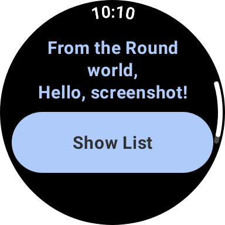

Warehouse management applcation for Wear OS smartwatch
==================================
This is the core of the application. The tests of this app was made on smartwatch samsung Galaxy Watch 7.

Presentation
------------

When starts the app, it can be seen a simple welcome. To use its functionalities, you just need to press the button that is shown.

Screenshot
-----------

Getting Started
---------------

This sample uses the Gradle build system. To build this project,
use the "gradlew build" command or use "Import Project" in Android Studio.

Designing for different display sizes
-------------------------------------

This sample demonstrates two techniques for helping you design for different display sizes:

1.  Compose [`WearPreviewDevices`][wear-preview-devices] and [`WearPreviewFontScales`][wear-preview-font-scales] annotations: These generate a set of previews in the preview pane within Android Studio, for a range of different screen sizes and font display size settings, allowing you to see how your design would look.

2.  Screenshot tests: This sample also demonstrates screenshot testing, for a set of [defined devices][wear-device]. For more information on screenshot testing, see this talk from [droidcon London][droidcon-talk], and see the [Continuous Integration][ci-guide] for more details on how to build screenshot
    testing into your automated workflows.

    - To generate new images for the tests, run `./gradlew recordRoborazziDebug`
    - To test against existing reference images, run `./gradlew verifyRoborazziDebug`
  
Together, this allows you to check for any unexpected visual changes to your UI, across a range of device sizes.

Support
-------

- Stack Overflow: https://stackoverflow.com/questions/tagged/wear-os

If you've found an error in this sample, please [create an issue](https://github.com/android/wear-os-samples/issues/new).

Patches are encouraged, and may be submitted by forking this project and
submitting a pull request through GitHub. Please see CONTRIBUTING.md for more details.

[documentation]: https://developer.android.com/reference/kotlin/androidx/wear/compose/material/package-summary.html
[horologist]: https://github.com/google/horologist
[droidcon-talk]: https://www.droidcon.com/2023/11/15/easy-screenshot-testing-with-compose/
[wear-device]: https://github.com/android/wear-os-samples/blob/main/ComposeStarter/app/src/test/java/presentation/WearDevice.kt
[wear-preview-font-scales]: https://developer.android.com/reference/kotlin/androidx/wear/compose/ui/tooling/preview/WearPreviewFontScales
[wear-preview-devices]: https://developer.android.com/reference/kotlin/androidx/wear/compose/ui/tooling/preview/WearPreviewDevices
[ci-guide]: https://developer.android.com/training/testing/continuous-integration
